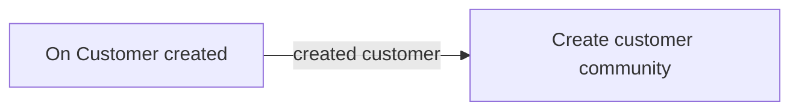

# bondbond - Directus’s Flow

---
## 📋 Table of Flow
 - [Create Customer Community Profile Flow](#create-customer-community-profile-flow )

## ⚡ Create Customer Community Profile Flow

This hook is designed to detect when a new user has been created, triggering Directus to create a customer with community data in the customer community collection.
### Diagram :

### Step :
    1. trigger when customer created
    2. create new field in customer community profile

